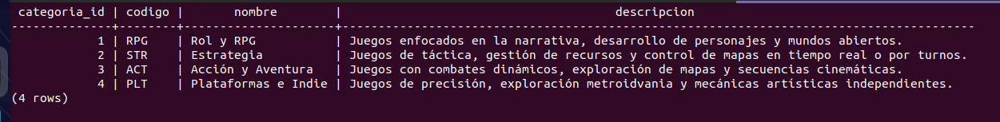
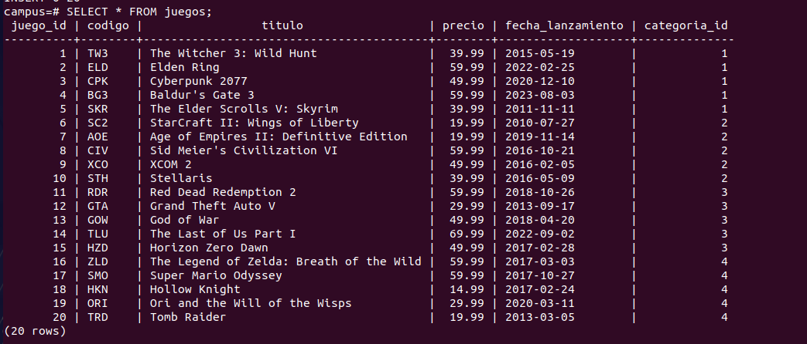
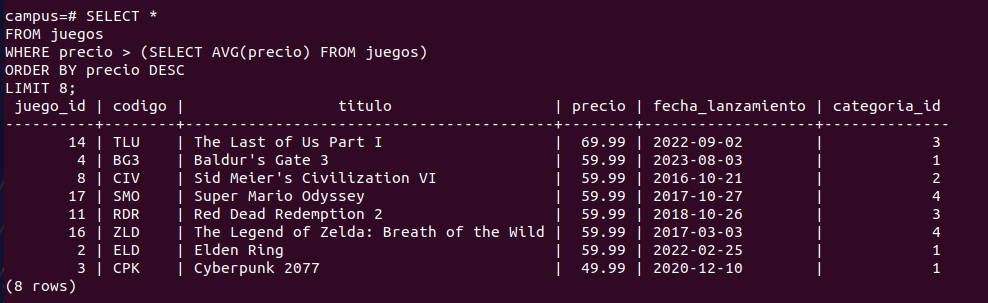
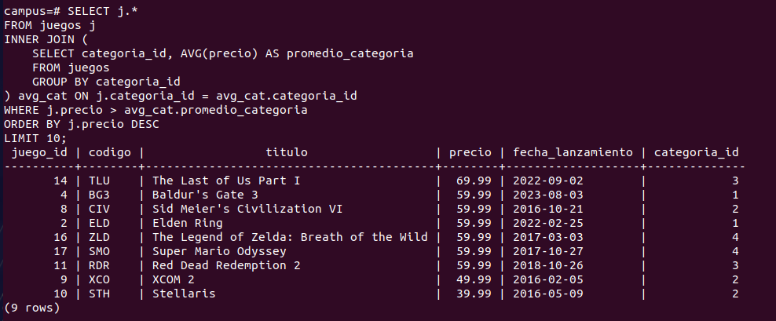

# Reto PostgreSQL - Gestión de Videojuegos y Categorías

Este repositorio contiene la solución al reto de diseño de base de datos relacional en PostgreSQL, migración de datos desde archivos semiestructurados (JSON y XML) y ejecución de consultas de análisis y auditoría.

---

## Estructura del Proyecto

```text
reto_postgresql/
├── database/
│   ├── ddl/
│   │   └── schema.sql        # Creación de tablas relacionales y temporales
│   ├── dml/
│   │   └── inserts.sql       # Extracción y carga desde JSON y XML
│   └── dql/
│       └── queries.sql       # Consultas de comparación y auditoría
├── docs/
│   ├── evidencias/           # Capturas de ejecución de la solución
│   │   ├── categorias.png
│   │   ├── consulta1-1.png
│   │   ├── consulta1-2.png
│   │   ├── consulta2.png
│   │   └── juegos.png
│   ├── categorias.json       # Datos fuente de categorías
│   └── juegos.xml            # Datos fuente de videojuegos
├── requirements.md           # Requerimientos del reto
└── README.md                 # Este archivo

```

---

## Resumen del Proyecto

1. **Diseño de Esquema (DDL):** Creación de las tablas `categorias` y `juegos` con sus respectivas llaves primarias, foráneas y restricciones únicas (`schema.sql`).
2. **Carga de Datos ETL (DML):** Importación de `categorias.json` mediante funciones JSONB y de `juegos.xml` usando `XMLTABLE` hacia las tablas relacionales (`inserts.sql`).
3. **Consultas de Análisis (DQL):** Ejecución de filtros avanzados para obtener juegos por encima del promedio general y por categoría, así como conteos de auditoría (`queries.sql`).

---

## Evidencias de Ejecución

Las evidencias del correcto funcionamiento se encuentran en la carpeta `docs/evidencias/`:

* **Datos cargados a la tabla categorias (DML):** 
* **Datos cargados a la tabla juegos (DML):** 
* **Juegos sobre el Promedio General:** 
* **Juegos sobre el Promedio por Categoría:** 
* **Conteo de Auditoría por Categoría:** 

## Autores
Stefani Sánchez y Jakelin Quino